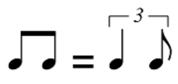

# gen-jazz-rhythm
Taking a lead-sheet score file (with melody and chord symbols), it generates a score with: 
- the same melody
- the chords (except the root note) for piano, with some syncopation
- the root note of each chord is assigned to a double-bass
- drums playing jazz rhythm:
  - basic ride cymbal and foot hi hat typical swing jazz rhythm, with some variations
  - occasionally, all-drum syncopations synchronised with the piano
  - occasionally, some crash cymbal or kick drum beat

<audio controls>
  <source src="https://github.com/tu-usuario/tu-repo/raw/main/carpeta/audio.mp3" type="audio/mp3">
  Tu navegador no soporta el elemento de audio.
</audio>

## Lead-sheet files
Lead-sheet scores are stored in XML files with melody and chord symbols. The files are contained in the folder Omnibook, which is a collection of 50 tunes and solos from Charlie Parker.

## Execution
Run `cellularautomaton_gradio.py`. It will show a URL which on clicking will open an interface in the default web browser. 

The interface is composed of: 
- two dropdown lists to select the tune and the melody instrument
- one button to show the lead-sheet score
- one button to add rhythm by executing the Cellular Automaton and show the score
- several sliders to control some parameters

## Score management and display
The music elements are managed with the `music21` python library. When the score is complete, it is shown in MuseScore (or another xml interpreter integrated with `music21`). 

In case the score is played in MuseScore, it will

## Credits
Omnibook files

Cellular Automaton framework: The Sound of AI

## Comments
### Chord types

### Tempo in Omnibook files
Tempo is included in the first measure of Omnibook files, and added to the score to be shown (and played)

### Swing style
In a standard swing style for slow to medium tempos (quarter=150 or less), two eighths are interpreted as a triplet of a quarter and an eighth.

Unfortunately, I have not seen a way for music21 to report MuseScore that the score must be played in swing style. However, in MuseScore the swing style can be configured in the "Format/Style..." menu. Clicking in "Score" it provides several swing configurations.  More information in MuseScore's page [Swing](https://musescore.org/en/handbook/3/swing).

### Key signature in Omnibook files
Although a Music XML file may include a key signature, this is not the case of the Omnibook files: they have a 

### Transposed instruments