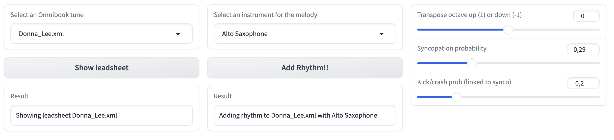

# Generating jazz rhythm
This repository is one of the practice exercises I developed for the [Generative Music AI course](https://www.youtube.com/playlist?list=PL-wATfeyAMNqAPjwGT3ikEz3gMo23pl-D) and [workshop](https://www.upf.edu/web/mtg/generative-music-ai-workshop), which took place in Barcelona between the 11-15 Dec 2023, jointly by [Valerio Velardo - The Sound of AI](https://thesoundofai.com/) and Universitat Pompeu Fabra - Music Technology Group.

It is based on a Celullar Automaton, one of the "classic" generative music AI methods introduced in the course. 

### Main functionality
Taking a lead-sheet score file (with melody and chord symbols), the Cellular Automaton generates a score with: 
- the same melody and improvisation
- the chords (except the root note) for piano, with some syncopation
- the root note of each chord is assigned to a double-bass
- drums playing jazz rhythm:
  - basic ride cymbal and foot hi hat play a typical swing jazz rhythm, with some variations
  - occasionally, all-drum syncopations synchronised with the piano
  - occasionally, some crash cymbal or kick drum beat

Next figure shows the first eight measures of Charlie Parker's "Donna Lee" lead-sheet:

[Download audio of Donna Lee lead-sheet](https://github.com/albertojulian/gen-jazz-rhythm/blob/main/readme_files/Donna_Lee_orig.mp3)

Next figure shows the first four measures of the Donna Lee score after the rhythm has been provided by the Cellular Automaton:

[Download audio of Donna Lee with rhythm](https://github.com/albertojulian/gen-jazz-rhythm/blob/main/readme_files/Donna_Lee_rhythm.mp3)

## Lead-sheet files
Lead-sheet scores are stored in XML files with melody and chord symbols. The files will be located in the folder Omnibook.

## Execution
- Install requirements.txt
- Download the [Charlie Parker Omnibook files](https://homepages.loria.fr/evincent/omnibook/), which is a collection of 50 lead-sheets (including melody and improvisation) from Charlie Parker in XML format. Copy the files into the `Omnibook` folder
- Run `cellularautomaton_gradio.py`. It will show a URL which, when clicked, will open a `gradio` interface in the default web browser.

The gradio interface is composed of: 
- two dropdown lists to select the tune and the melody instrument
- one button to show the lead-sheet score
- one button to add rhythm by executing the Cellular Automaton and show the score (see **Swing Style Setting** below)
- some sliders to control several parameters

## Score management and display
The music elements are managed with the `music21` python library. When the score is complete, it is shown in MuseScore (or another MusicXML viewer integrated with `music21`). 

## Files
- `omnibook_read.py`: reads the selected Omnibook file and extracts the melody (and the improvisation) in `music21` format, and the chord symbols.
- `cellularautomaton_gradio.py`: defines a state along the melody pattern and modifies it according to rules. It also includes the `gradio` interface to select tune, melody instrument and parameters.
- `pattern_m21_converter.py`: converts the state generated by the Cellular Automaton into `music21` elements.
- `m21_musescore.py`: includes the `class M21_and_show`, which mainly translates a chord symbol sequence into a `music21` chord and bass sequence; the `chord_dict` defines the chord types, and their versions.

## References
**Cellular Automaton lectures** in the [Generative Music AI course](https://www.youtube.com/playlist?list=PL-wATfeyAMNqAPjwGT3ikEz3gMo23pl-D), which cover both [theory](https://www.youtube.com/watch?v=YoRPjU_Fbq0) and [practice](https://www.youtube.com/watch?v=GIoLWVPb8mc).

**[Charlie Parker Omnibook MusicXML files](https://homepages.loria.fr/evincent/omnibook/)**: Ken Déguernel, Emmanuel Vincent, and Gérard Assayag. "Using Multidimensional Sequences for Improvisation in the OMax Paradigm",
in Proceedings of the 13th Sound and Music Computing Conference, 2016.

## Comments

### Tempo in Omnibook files
Tempo is included in the first measure of Omnibook files, and added to the score to be shown (and played)

### Swing Style Setting
In a standard swing style for slow to medium tempos (quarter=150 or less), two eighths are interpreted as a triplet of a quarter and an eighth: 

Unfortunately, I have not seen a way in `music21` to report MuseScore that the score must be played in swing style. However, in MuseScore the swing style can be configured in the "Format/Style..." menu. Clicking in "Score" it provides several swing configurations; for slow to medium tempos (like in Billie's Bounce, with quarter=165), swing ratio for an eighth could be set as 66%, while for faster tempos (like in "Bird gets the worm", with quarter=340!!) it could be reduced to 55%. More information in MuseScore's page [Swing](https://musescore.org/en/handbook/3/swing).

### Key signature in Omnibook files
Although a Music XML file may include a proper key signature, all Omnibook files are loaded in `music21` with a C major / A minor key signature: `<music21.key.KeySignature of no sharps or flats>`. This is the reason why none of the Omnibook lead-sheets display a key signature in MuseScore.

In order to display the Omnibook files with the proper key signature in MuseScore, the following sentences are executed:
`score = m21.converter.parse(omni_file); key = score.analyze("key")`

### Transposed instruments
Instruments such as an alto sax or a tenor sax, are said to be transposed: when a tenor sax in Bb plays a C, it sounds as a Bb; in other words, the transposition interval is **two semitones down**. 

Therefore, if we want to assign a tenor sax in Bb to a part in C, and we want to hear the part in C, the part must be transposed **two semitones up** (D). This is the reason why the scores of Omnibook files with rhythm may have different key signatures for melody and chord parts.
